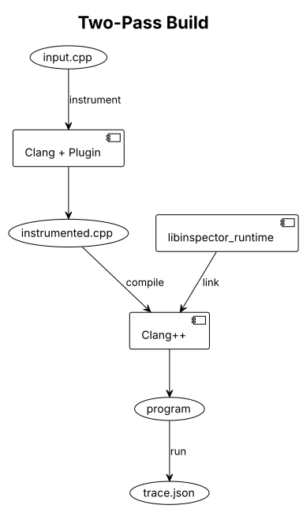
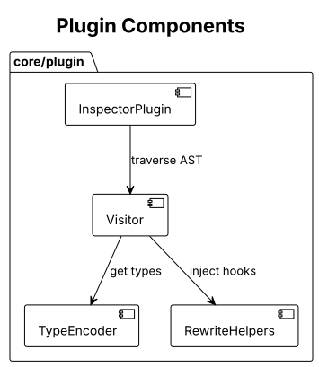
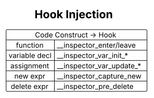
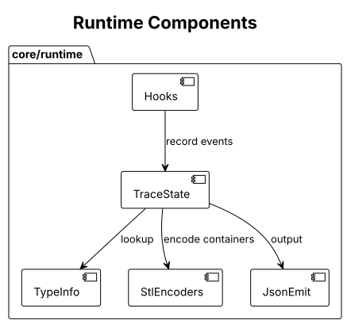
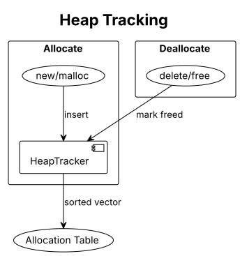
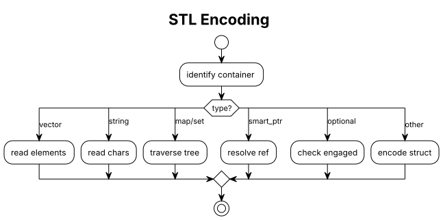

# C++ Runtime Inspector Architecture

This document describes the internal architecture of the C++ Runtime Inspector
instrumentation and tracing system.

## Overview

C++ Runtime Inspector uses a two-pass build model.



### Pass 1: Instrumentation

The Clang plugin parses the AST and rewrites the source to insert tracing hooks.

### Pass 2: Compilation

The instrumented source is compiled and linked with the runtime library.

### Execution

The instrumented binary emits trace events to stderr as it runs.

## Plugin Architecture



```
core/plugin/
├── InspectorPlugin.cpp    # Plugin registration
├── Visitor.h/cpp          # AST traversal
├── TypeEncoder.h/cpp      # Type descriptor generation
├── RewriteHelpers.h/cpp   # Source rewriting utilities
└── Diagnostics.h/cpp      # Warning emission
```

### Visitor

The `InstrumentVisitor` is a `RecursiveASTVisitor` that traverses the AST and
instruments:

- **Variable declarations** (`VisitVarDecl`) - Track initialization
- **Assignments** (`VisitBinaryOperator`) - Track value updates
- **Compound assignments** (`VisitCompoundAssignOperator`) - +=, -=, etc.
- **Increment/Decrement** (`VisitUnaryOperator`) - ++, --
- **Function calls** (`VisitCallExpr`) - Entry/exit hooks
- **New/Delete** (`VisitCXXNewExpr`, `VisitCXXDeleteExpr`) - Heap tracking
- **Exceptions** (`VisitCXXThrowExpr`, `VisitCXXCatchStmt`)



### TypeEncoder

Generates compile-time type descriptors for each type used in the program:

```cpp
const inspector::TypeDescriptor __inspector_type_int = {
    inspector::TypeKind::Int,
    "int",
    sizeof(int),
    nullptr, 0, nullptr, 0
};
```

For composite types, it generates field information:

```cpp
const inspector::FieldInfo __inspector_fields_Node[] = {
    {"value", offsetof(Node, value), &__inspector_type_int, ...},
    {"next", offsetof(Node, next), &__inspector_type_Node_ptr, ...}
};
```

### Rewriting Strategy

The plugin uses `clang::Rewriter` to modify source text. Key patterns:

1. **Variable initialization**: Insert hook after semicolon
   ```cpp
   int x = 5;
   // becomes:
   int x = 5; __inspector_var_init_int("x", &x, &type, x, __LINE__);
   ```

2. **Assignments**: Wrap in comma expression
   ```cpp
   x = 10;
   // becomes:
   (__inspector_var_update_int("x", &x, &type, x = 10), x = 10);
   ```

3. **New expressions**: Wrap with capture template
   ```cpp
   new int(5)
   // becomes:
   ::inspector::__inspector_capture_new<int>(new int(5), &type)
   ```

## Runtime Architecture



```
core/runtime/
├── inspector_runtime.h       # Public C API
└── inspector/
    ├── Trace.h/cpp          # State management
    ├── TypeInfo.h/cpp       # Type descriptors
    ├── JsonEmit.h/cpp       # OPT format emission
    ├── Hooks.cpp            # Hook implementations
    ├── StlEncoders.h/cpp    # STL container encoding
    ├── StringSafe.h/cpp     # SIGSEGV-protected reads
    └── Signals.h/cpp        # Crash handlers
```

### TraceState

Singleton managing execution trace:

- Call stack of frames
- Variable states per frame
- Heap allocation tracking
- Event recording and emission

### Type Descriptors

Runtime type information for encoding values:

```cpp
struct TypeDescriptor {
    TypeKind kind;
    const char* spelling;
    size_t size;
    const FieldInfo* fields;
    size_t field_count;
    const TypeDescriptor* element_type;
    size_t element_count;
    // ... enum info, base classes, etc.
};
```

### Heap Tracking



The runtime maintains a sorted vector of allocations:

```cpp
struct Allocation {
    void* base;
    size_t size;
    const TypeDescriptor* type;
    int heapId;
    bool freed;
    // ...
};
```

Operations:
- **Insert**: O(log n) binary search + O(n) insert
- **Resolve**: O(log n) binary search
- **Free**: O(log n) lookup + mark (no remove)

### Value Encoding

Values are encoded into a variant type for JSON emission:

```cpp
using EncodedValue = std::variant<
    long long,              // Signed integers
    unsigned long long,     // Unsigned integers
    double,                 // Floats
    bool,                   // Booleans
    char,                   // Characters
    std::string,            // Strings
    std::vector<std::string>, // Pointers
    StructValue,            // Structs/classes
    ArrayValue,             // Arrays
    EnumValue_,             // Enums
    UnionValue,             // Unions
    HeapRef                 // Heap references
>;
```

## Hook Interface

C-linkage functions called by instrumented code:

```cpp
// Function tracking
void __inspector_enter(const char* funcName, int line);
void __inspector_leave(const char* funcName, int line);
void __inspector_step(int line);

// Variable tracking (type-specific)
void __inspector_var_init_int(const char* name, void* addr,
    const TypeDescriptor* type, long long value, int line);
void __inspector_var_update_int(const char* name, void* addr,
    const TypeDescriptor* type, long long value);
// ... similar for uint, float, bool, char, ptr, ref, struct, etc.

// Heap tracking
int __inspector_alloc(void* ptr, size_t size, const TypeDescriptor* type,
    bool isArray, size_t arrayCount);
void __inspector_dealloc(void* ptr);

// Template wrappers for new/delete
template<typename T>
T* __inspector_capture_new(T* ptr, const TypeDescriptor* type);
template<typename T>
void __inspector_pre_delete(T* ptr);
```

## STL Encoding



STL containers are encoded by reading their internal representation:

### std::vector

```cpp
// Internal layout (libstdc++):
// _M_start: pointer to first element
// _M_finish: pointer past last element
// _M_end_of_storage: pointer to allocated end

const char* start = /* read _M_start */;
const char* finish = /* read _M_finish */;
size_t count = (finish - start) / elementSize;
// Encode each element
```

### std::string

Uses direct cast (SSO-aware):
```cpp
const std::string* str = reinterpret_cast<const std::string*>(addr);
return *str;  // Works for both SSO and heap-allocated
```

## Signal Handling

Crash handlers for graceful degradation:

```cpp
void crashHandler(int sig, siginfo_t* info, void* context) {
    // Format crash message (async-signal-safe)
    // Emit partial trace
    // Re-raise signal for proper exit code
}
```

Handled signals: SIGSEGV, SIGABRT, SIGFPE, SIGBUS, SIGILL

## Resource Limits

Built-in limits prevent runaway execution:

| Limit          | Default   | Configuration            |
|----------------|-----------|--------------------------|
| Event count    | 100,000   | `TraceState::setMaxEvents()` |
| Output size    | 50 MB     | `JsonEmitter::emit()` parameter |

External limits (enforced by runner):
- Wall-clock timeout
- Memory limit (ulimit/cgroups)
- Process count limit

## Build Integration

### CMake

```cmake
find_package(LLVM REQUIRED CONFIG)
find_package(Clang REQUIRED CONFIG)

add_library(InspectorPlugin MODULE core/plugin/*.cpp)
target_link_libraries(InspectorPlugin PRIVATE clangAST clangRewrite ...)

add_library(inspector_runtime STATIC core/runtime/*.cpp)
```

### Usage

```bash
# Instrument
clang++ -fsyntax-only -fplugin=libInspectorPlugin.so input.cpp

# Compile
clang++ input.cpp.instrumented.cpp libinspector_runtime.a -o program

# Run
./program 2> trace.json
```

## Deviations from Plan

Notable implementation decisions:

1. **Sorted vector for heap tracking** - Simpler than interval tree,
   sufficient for educational workloads

2. **Type-specific hooks** - Chose over variadic hooks for type safety
   and simpler runtime dispatch

3. **Direct std::string cast** - Instead of manual SSO detection, relies
   on ABI stability

4. **Skip STL instrumentation** - Container internals are handled by
   runtime encoders, not plugin instrumentation
